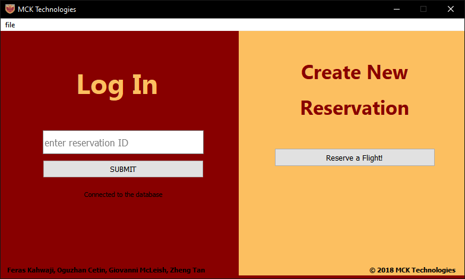
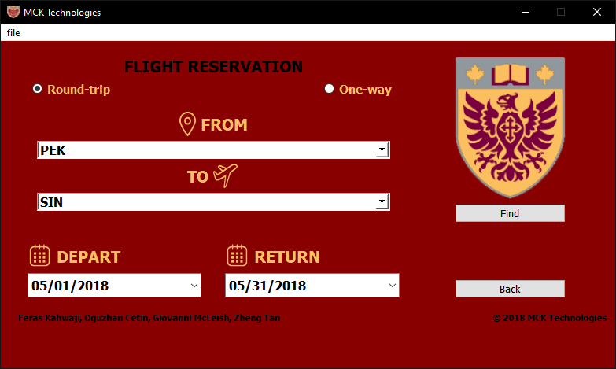
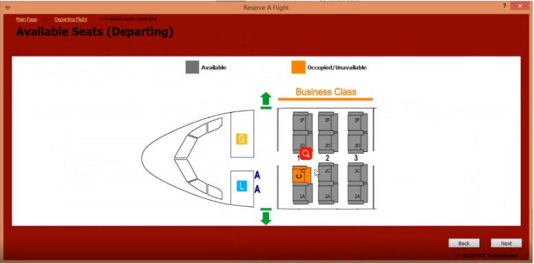
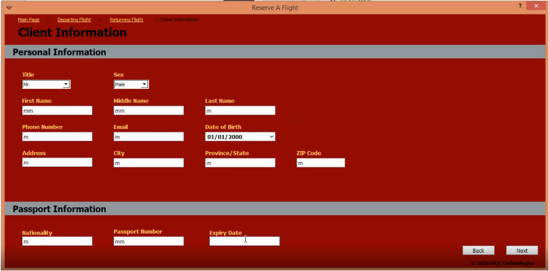

# Airline-Reservation-Simulation
Allows users to reserve one-way or two-way flights. Users are asked to select a seat in the plane and input their personal information as part of the reservation creation. A reservation ID is produced that will be used to sign in when the user wants to edit or change flights.

# Preview

